# 3GPP TDoc Decision States - State Diagram

## Overview

This diagram shows the possible decision states for TDoc entries and the allowed transitions between them, including both original decision states and user approval states.

## Two-Column State System

The application manages two distinct state systems:

### Decision Column (External/System State)

This column contains states from external sources (3GPP HTML imports) or system-assigned states:

**Actionable Decision States:**
- `available` (Yellow #FFFF99) - TDoc is available for user action
- `reserved` (Red #FF8566) - TDoc slot reserved for revision (child of revised TDoc)

**Terminal Decision States (No user actions allowed):**
- `approved` (Green #99FF33) - TDoc has been approved externally
- `revised` (Green #99FF33) - TDoc has been revised and has a child TDoc
- `postponed` (Green #99FF33) - TDoc has been postponed externally  
- `withdrawn` (Red #FFB3B3) - TDoc has been withdrawn
- `merged` (Green #FFB3B3) - TDoc has been merged
- `replied to` (Green #FFB3B3) - LS In has been replied to

### My Approval Column (User State)

This column contains user approval decisions that can be applied to actionable TDocs:

**User Approval Actions (all display as Green #99FF33):**
- `approved` - User approves the TDoc
- `agreed` - User agrees with the TDoc
- `noted` - User notes the TDoc  
- `revised` - **TERMINAL** - User requests revision, creates Reserved child TDoc
- `postponed` - User requests postponement
- `not pursued` - User suggests not pursuing

**Special User Action:**
- `clear/revert` - Removes user approval, reverts to original decision state color

## State Transition Diagram

```mermaid
flowchart TB
    Start([📥 Import/Create TDoc])
    
    subgraph "🏛️ Decision Column (External/System State)"
        direction TB
        DecAvailable[📋 Available<br/>Yellow - Actionable]
        DecApproved[✅ Approved<br/>Green - Final]  
        DecRevised[🔄 Revised<br/>Green - TERMINAL<br/>Has child TDoc]
        DecReserved[🔒 Reserved<br/>Red - Actionable<br/>Child of revised TDoc]
        DecPostponed[⏸️ Postponed<br/>Green - Final]
        DecWithdrawn[❌ Withdrawn<br/>Red - TERMINAL]
        DecMerged[🔗 Merged<br/>Green - TERMINAL] 
        DecRepliedTo[✉️ Replied To<br/>Green - TERMINAL]
    end
    
    subgraph "👤 My Approval Column (User State)"
        direction TB
        UserApproved[👍 Approved]
        UserAgreed[🤝 Agreed]
        UserNoted[📝 Noted]
        UserRevised[🔄 Revised<br/>TERMINAL - Creates Reserved TDoc<br/>❗ Can be cleared]
        UserPostponed[⏸️ Postponed]
        UserNotPursued[🚫 Not Pursued]
        UserClear[❌ Clear Approval<br/>Remove user state<br/>Revert to decision color]
    end
    
    %% Entry flows to Decision states
    Start --> DecAvailable
    Start --> DecApproved
    Start --> DecRevised
    Start --> DecReserved
    Start --> DecPostponed
    Start --> DecWithdrawn
    Start --> DecMerged
    Start --> DecRepliedTo
    
    %% Actionable Decision states can receive User actions
    DecAvailable -.-> UserApproved
    DecAvailable -.-> UserAgreed
    DecAvailable -.-> UserNoted
    DecAvailable -.-> UserRevised
    DecAvailable -.-> UserPostponed
    DecAvailable -.-> UserNotPursued
    
    DecReserved -.-> UserApproved
    DecReserved -.-> UserAgreed
    DecReserved -.-> UserNoted
    DecReserved -.-> UserRevised
    DecReserved -.-> UserPostponed
    DecReserved -.-> UserNotPursued
    
    %% All user approval states can be cleared
    UserApproved -.-> UserClear
    UserAgreed -.-> UserClear
    UserNoted -.-> UserClear
    UserRevised -.-> UserClear
    UserPostponed -.-> UserClear
    UserNotPursued -.-> UserClear
    
    %% Special workflow: User Revised creates new TDoc
    UserRevised --> NewTDoc[📄 Creates New TDoc<br/>with Decision: Reserved]
    UserRevised --> UserTerminal[🔒 Original TDoc userApproval: Revised<br/>TERMINAL - No other user actions]
    
    %% Clear approval mechanism
    UserClear --> OriginalColor[🎨 Reverts to Decision State Color<br/>userApproval = null<br/>TDoc becomes actionable again]
    
    %% Terminal Decision states block approval actions but allow comments
    DecRevised -.❌.-> BlockedApprovals[🚫 No Approval Actions<br/>Use child TDoc instead]
    DecWithdrawn -.❌.-> BlockedApprovals
    DecMerged -.❌.-> BlockedApprovals
    DecRepliedTo -.❌.-> BlockedApprovals
    DecApproved -.❌.-> BlockedApprovals
    DecPostponed -.❌.-> BlockedApprovals
    
    %% But comments are available for all states
    DecRevised -.-> Comments[💬 Comments Always Available]
    DecWithdrawn -.-> Comments
    DecMerged -.-> Comments
    DecRepliedTo -.-> Comments
    DecApproved -.-> Comments
    DecPostponed -.-> Comments
    DecAvailable -.-> Comments
    DecReserved -.-> Comments

    %% Styling
    classDef start fill:#E6F3FF,stroke:#333,stroke-width:2px
    classDef available fill:#FFFF99,stroke:#333,stroke-width:2px
    classDef green fill:#99FF33,stroke:#333,stroke-width:2px
    classDef red fill:#FF8566,stroke:#333,stroke-width:2px
    classDef terminal fill:#FFB3B3,stroke:#333,stroke-width:3px
    classDef userAction fill:#66CC00,stroke:#333,stroke-width:2px
    classDef workflow fill:#E6E6FA,stroke:#333,stroke-width:2px
    classDef revert fill:#FFA500,stroke:#333,stroke-width:2px
    classDef comments fill:#E0E0E0,stroke:#333,stroke-width:2px
    classDef blocked fill:#FFCCCC,stroke:#333,stroke-width:2px

    class Start start
    class DecAvailable available
    class DecApproved,DecRevised,DecPostponed green
    class DecReserved red
    class DecWithdrawn,DecMerged,DecRepliedTo,UserTerminal terminal
    class UserApproved,UserAgreed,UserNoted,UserRevised,UserPostponed,UserNotPursued userAction
    class NewTDoc,OriginalColor workflow
    class UserClear revert
    class Comments comments
    class BlockedApprovals blocked
```



## State Validation Rules

### Actionable States (can receive user approval actions)

- `available` - Primary actionable state
- `reserved` - Can be acted upon (revision TDocs)  
- `revised` - Can receive further actions

### Blocked States (cannot receive user actions)

- `withdrawn` - Terminal state, completely blocked
- `merged` - Terminal state, completely blocked  
- `replied to` - Terminal state, completely blocked

## Critical Workflows

### Revision Creation Workflow

When user applies "Revised" approval to any actionable TDoc:

1. **Original TDoc - User State Only:**
   - `decision` column remains UNCHANGED (preserves external state)
   - `userApproval` column set to "revised" 
   - TDoc becomes terminal for user actions (prevents orphaning)

2. **New Reserved TDoc created:**
   - New TDoc with `decision: "reserved"` (system-assigned)
   - Parent-child relationship via `replaces`/`replacedBy`
   - New TDoc can receive user actions

3. **Clear Approval Option:**
   - User can clear any approval state (including "revised")
   - Sets `userApproval = null` and `userComments = null`
   - Row color reverts to original decision state color
   - TDoc becomes actionable again (if decision state allows)
   - For revised approvals: Reserved child TDoc should be removed

### Import/Sync Workflow

When importing updated 3GPP agenda:

1. **Decision Column Sync:**
   - External `decision` states are updated from new HTML
   - May change from "available" to "approved", "revised", etc.

2. **User Data Preservation:**
   - `userApproval` and `userComments` columns are preserved
   - User workflow state is maintained across imports

3. **State Reconciliation:**
   - If external `decision` becomes terminal, user actions are blocked
   - User can still revert their approvals if needed

### State Validation Logic

**Actionable TDoc Requirements (for approval actions):**
- `decision` state must be `available` OR `reserved`
- AND `userApproval` must be empty OR reverted
- Terminal `decision` states (`withdrawn`, `merged`, `replied to`, `approved`, `revised`, `postponed`) block approval actions

**Comments Availability:**
- `userComments` textbox available for ALL states (actionable and terminal)
- Users can add/edit comments regardless of decision state
- Comments are preserved across imports and state changes

**User Actions Rules:**
- NEVER modify `decision` column - it's external/system data
- Only update `userApproval` and `userComments` columns
- `userApproval: "revised"` creates terminal condition for that TDoc
- Prevents orphaning of newly created Reserved TDoc
- Can be resolved by clearing the user approval

**Clear Approval Functionality:**
- Available for ALL user approval states
- Sets `userApproval = null` (comments can be preserved or cleared)
- Row color reverts from user approval color to decision state color
- TDoc actionability determined by decision state after clearing
- For "revised" approvals: should also clean up orphaned Reserved TDoc

**Comments Functionality:**
- `userComments` textbox available regardless of decision or approval state
- Users can add/edit comments on ANY TDoc (terminal or actionable)
- Comments preserved across imports, state changes, and approval clearing
- Provides audit trail and notes capability for all workflow states

**Import/Sync Behavior:**
- `decision` column updated from external source during import
- `userApproval` and `userComments` preserved across imports
- State reconciliation may block user actions if `decision` becomes terminal

## Implementation Details

### State Storage

- `decision` - Original state from HTML or system-assigned
- `userApproval` - User's approval decision (overrides display color)
- `userComments` - User's additional comments

### Color Priority

1. User approval state colors (if `userApproval` exists)
2. Original cell colors from HTML (if preserved)
3. Decision state colors (fallback)
4. Default white

### Validation Logic

```javascript
const blockedStates = ['withdrawn', 'merged', 'replied to'];
const isActionable = !blockedStates.includes(decision?.toLowerCase());
```

This state diagram ensures proper workflow management while preserving the original 3GPP decision states and allowing user workflow overlay.